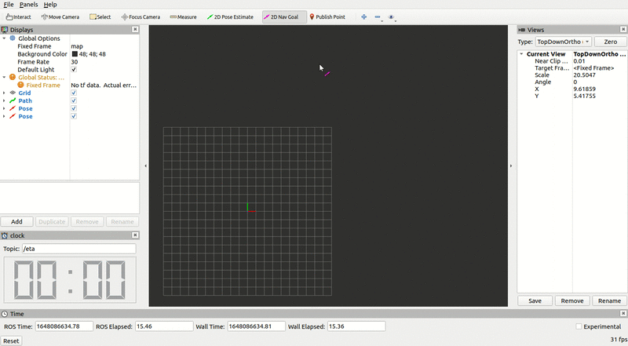

# Rviz clock plugin 

# Preview


Test
```
roslaunch rviz_clock_plugin test.launch
```

## Aditional ressources

* QT QLCNumber https://doc.qt.io/qt-5/qlcdnumber.html

* Ros plugin tutorials
https://github.com/ros-visualization/visualization_tutorials/tree/noetic-devel/rviz_plugin_tutorials
* jsk rviz plugin repo https://github.com/jsk-ros-pkg/jsk_visualization/tree/master/jsk_rviz_plugins
  
## icon
https://www.flaticon.com/free-icons/clock
